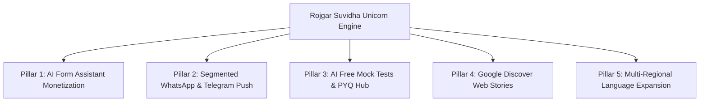

# 🦄 Rojgar Suvidha — Unicorn Scaling Roadmap (0 to 10 Million Candidates)

A master strategic blueprint to scale **Rojgar Suvidha** from a government job portal into India's premier $1B+ Sarkari career, preparation & application ecosystem (alongside platforms like Testbook, Physics Wallah, Adda247, and SarkariResult).

---

## 🏛️ The 5 Core Growth Pillars

---

## 1. 💳 Pillar 1: AI "Apply For Me" Form Filling Engine (Monetization)
**Concept:** Convert job discovery into instant execution. 80% of candidates in tier-2/tier-3 cities go to cyber cafes and pay ₹100–₹150 to fill out online forms.

### Execution Blueprint:
1. **One-Time Document Vault:** Candidates upload 10th/12th marksheets, passport photo, signature, caste certificate once into their encrypted profile.
2. **1-Click Auto-Fill:** When a new job (e.g. UP Police or SSC MTS) opens, the candidate clicks **"Apply For Me"**.
3. **Automated Submission:** Your backend processes the form and uploads proof of submission / application receipt to candidate's dashboard.
4. **Revenue Model:**
   - Charge **₹49 per form** (Instant Cyber Cafe replacement).
   - At **10,000 applications/month** = **₹4,90,000/month recurring net profit**.
   - At **100,000 applications/month** = **₹49,00,000/month**.

---

## 2. 📲 Pillar 2: Segmented WhatsApp & Telegram Push Engine (Viral Traffic)
**Concept:** Don't wait for candidates to search Google — push real-time notifications directly to their phone screens based on state & qualification.

### Execution Blueprint:
1. **State & Qualification Preference Tags:**
   - Candidate subscribes to: `UP State Jobs`, `10th Pass Jobs`, `Graduate Banking Jobs`.
2. **Instant Broadcast Automation:**
   - When an Admit Card or Result for UP Police drops, a targeted WhatsApp/Telegram push fires instantly to the `UP State Jobs` subscriber list.
3. **Traffic Spikes:** 50,000 instant clicks within 2 minutes of notification release ➔ Forces Google to index and boost your URL to rank #1.

---

## 3. 🎯 Pillar 3: AI Free Mock Tests & Previous Year Papers (Candidate Retention)
**Concept:** Increase Dwell Time from 1 minute to 15+ minutes. Testbook grew into a Unicorn by giving free mock tests attached to exam notifications.

### Execution Blueprint:
1. **Notification + Practice Widget:**
   At the bottom of every job post (e.g., *SSC CGL 2026*), embed an **"AI Quick Practice Quiz"** (10 Free Questions).
2. **Dynamic PYQ (Previous Year Questions) Generator:**
   Gemini 3.6 Flash generates subject-wise quizzes (GK, Reasoning, Math, English) relevant to that specific job.
3. **SEO Impact:** High dwell time signals to Google that Rojgar Suvidha is the most helpful destination, boosting search rankings across all keywords.

---

## 4. ⚡ Pillar 4: Google Discover & Web Stories Dominance (500K Daily Views)
**Concept:** Google Discover feeds on Android smartphones deliver millions of free daily impressions to Indian Sarkari portals.

### Execution Blueprint:
1. **Google Web Stories Integration:**
   Generate 4-slide AMP Web Stories for every major trending result/admit card (*Slide 1: Headline, Slide 2: Dates, Slide 3: How to Check, Slide 4: Swipe Up Link*).
2. **Live Blog Schema:**
   For high-stakes exam days (e.g. *UPSC Mains, NEET Result Day*), enable LiveBlogPosting schema for real-time minute-by-minute updates.
3. **Google Publisher Center:** Submit site RSS feeds to Google News to appear in Google News App and Android swipe-left Discover feeds.

---

## 5. 🌐 Pillar 5: Multi-Regional Language Expansion (Hindi, Marathi, Bengali, Telugu)
**Concept:** Capture regional state job markets where competition is low and intent is extremely high.

### Execution Blueprint:
1. **Auto-Translate Engine:**
   - `gemini-3.6-flash` converts job posts into **Devanagari Hindi**, **Marathi**, **Bengali**, and **Telugu** versions instantly.
2. **State Specific Hubs:**
   - `/state/up` (Hindi)
   - `/state/mh` (Marathi)
   - `/state/wb` (Bengali)
   - `/state/ts` (Telugu)
3. **Local SEO Dominance:** Rank #1 for state public service commission searches (MPSC, WBPSC, TSPSC) in candidates' native scripts.

---

## 📈 12-Month Execution Milestones

| Phase | Duration | Focus Area | Key Metric Target |
|---|---|---|---|
| **Phase 1** | Month 1–2 | Google Discover Web Stories & Auto Telegram Channel | 100K Monthly Active Users |
| **Phase 2** | Month 3–4 | Segmented WhatsApp Channel & State Push Alerts | 500K Monthly Active Users |
| **Phase 3** | Month 5–6 | AI Form Filling "Apply For Me" Vault | ₹5 Lakhs/Month Revenue |
| **Phase 4** | Month 7–9 | AI Free Mock Tests & Previous Year Papers | 15 min Average Dwell Time |
| **Phase 5** | Month 10–12 | Multi-Language Regional Expansion | 10 Million Monthly Candidates |

---
*Blueprint created for Rojgar Suvidha scaling trajectory.*
